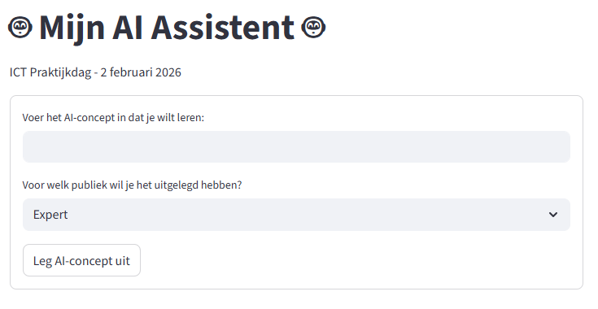

# ICT Praktijkdag - [Maak je eigen AI-assistent](https://www.ictdag.be/48/aanbod/sessie/102)

Workshop materiaal voor het bouwen van AI-applicaties met Python en Streamlit.

**Datum:** 2 februari 2026

**Lesgever:** Wim Casteels - [wimcasteels.be](https://wimcasteels.be)



## Workshop volgen via GitHub Codespaces

**Tip:** Fork deze repository eerst naar je eigen GitHub account. Zo kan je je wijzigingen bewaren en later je app deployen via Streamlit Cloud.

1. Klik rechtsboven op **Fork** om de repository te kopiëren naar je eigen account
2. Ga naar jouw geforkte repository
3. Klik op de groene **Code** knop
4. Selecteer het tabblad **Codespaces**
5. Klik op **Create codespace on main**
6. Wacht tot de omgeving is opgestart - alle dependencies worden automatisch geïnstalleerd
7. Je kan nu de notebooks en applicaties uitvoeren in de browser

## Inhoud

### Python_met_AI.ipynb
Jupyter notebook dat een aantal Python functies behandelt die van pas komen om een AI app te maken:
- Basisconcepten: strings, integers, floats
- f-Strings voor het combineren van tekst en berekeningen
- Variabelen en hun gebruik in prompts
- Werken met de `chatbot_response()` functie om een LLM aan te spreken

### eerste_app.py
Een voorbeeld van een eenvoudige Streamlit applicatie met:
- Titel en tekst weergave
- Interactieve slider
- Berekeningen (kwadraat en vierkantswortel)

Run de app lokaal:
```bash
streamlit run eerste_app.py
```

### AI_app.py
Een voorbeeld van een AI applicatie die:
- Gebruikersinput verzamelt via een formulier
- AI concepten uitlegt aangepast aan het niveau van de gebruiker (Expert, Leek, 12-jarig kind)
- Gebruik maakt van de Cohere API voor het genereren van antwoorden

Run de app lokaal:
```bash
streamlit run AI_app.py
```

## Installatie

```bash
pip install -r requirements.txt
```

## Deployment

Je kan de app deployen via [Streamlit Cloud](https://streamlit.io/cloud). Het enige wat je nodig hebt is een openbare GitHub repository waar je app staat. Volg hiervoor de instructies op de Streamlit Cloud website.
